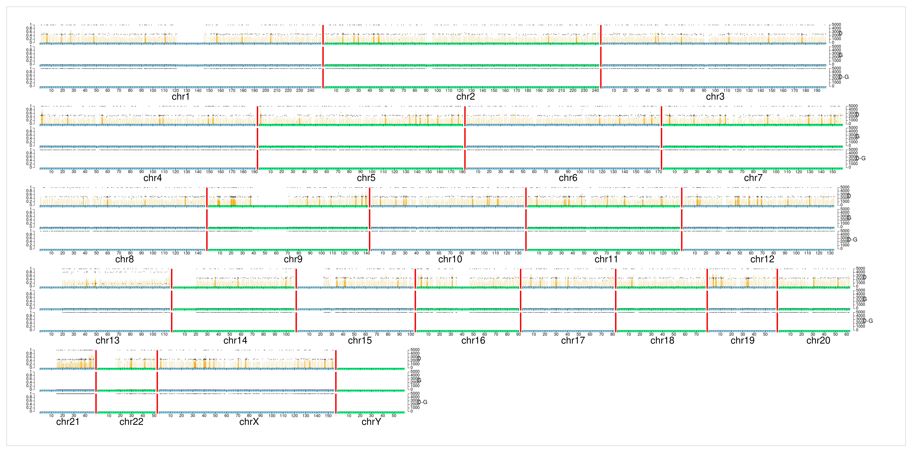

<p align="center">

  <p align="center">
    Supplementary Data for
  </p>
  <h1 align="center">
    SJPedPanel: A pan-cancer gene panel for childhood malignancies
  </h1>

  <br>
  <p align="center">
  Pandurang Kolekar<sup>1*</sup>, Vidya Balagopal<sup>2*</sup>, Li Dong<sup>1*</sup>, Yanling Liu<sup>1</sup>, Scott Foy<sup>1</sup>, Quang Tran<sup>1</sup>, Heather Mulder<sup>1</sup>, Anna LW Huskey<sup>2</sup>, Emily Plyler<sup>1</sup>, Zhikai Liang<sup>1</sup>, Jingqun Ma<sup>2</sup>, Joy Nakitandwe<sup>3</sup>, Jiali Gu<sup>2</sup>, Jamie Maciaszek<sup>2</sup>, Debbie Payne-Turner<sup>2</sup>, Saradhi Mallampati<sup>2</sup>, Lu Wang<sup>2</sup>, Elizabeth Stewart<sup>4</sup>, John Easton<sup>1</sup>, Jeffery M. Klco<sup>2#</sup>, Xiaotu Ma<sup>1#</sup>
 </p>

  <p align="center">
   <br/>
   <sup>1</sup>: Department of Computational Biology, St. Jude Children’s Research Hospital, Memphis, TN, USA<br/>
   <sup>2</sup>: Department of Pathology, St. Jude Children’s Research Hospital, Memphis, TN, USA<br/>
   <sup>3</sup>:  Department of Laboratory Medicine, Pathology and Laboratory Medicine Institute,
Cleveland Clinic, OH, USA<br/>
<sup>4</sup>: Department of Oncology, St. Jude Children’s Research Hospital, Memphis, TN, USA<br/><br/>
   <sup>*</sup>: Contributed equally</br>
   <sup>#</sup>: correspondence authors</br>
   <br/>
  </p>
</p>

---

## Description of the files

The repository consists of the following files,

```
.
├── Allelic_imbalance_figures.zip
├── CNVkit_Tumor_diagrams.pdf
├── CNVkit_output_files.zip
├── README.md
└── example
    └── SJAML030006_D1.ai.jpg
```

### Allelic_imbalance_figures.zip
- This zipped folder consists of allelic imbalance plots (format: jpg) for all the samples used for analytical validation
- These plots were manually reviewed to determine Loss of Heterozygosity (LOH) events in tumor samples
- Files are named as follows, `<Case ID>_<Sample type>.ai.jpg`
- Sample type `D1` indicates tumor sample whereas `G1` indicates normal sample
- Representative figure for the sample SJAML030006_D1: 
- Figure Description
  - The figure consists of allelic frequencies of SNPs in chromosome-wise manner
  - The Y axes on the left denotes allele frequency of SNPs shown as points/dots and secondary Y-axes on right indicate depth of coverage (capped at 5000) shown by orange bars.
  - The X axis indicate genomic position on the chromosome
- In the above figure, it can be clearly seen that minor allele frequencies (MAF) of SNPs on chromosome 13 are deviated from their expected MAF of 0.5, as observed in rest of the chromosomes. 

### File: CNVkit_Tumor_diagrams.pdf

- This PDF file consists of chromosome-wise CNV calls for sample one per page. The red region indicates copy number gain whereas blue region indicate copy number loss. The intensity of color is proportional to log2 ratio of the call.
- The description of the figure is available from CNVkit documentation [here](https://cnvkit.readthedocs.io/en/stable/plots.html#diagram)

### CNVkit_output_files.zip
- This zipped folder consists of output files (format: text) generated by the CNVkit v0.9.10 ([Talevich E. et al., 2016](https://doi.org/10.1371/journal.pcbi.1004873)) for tumor samples of 113 cases sequenced for analytical validation of the SJPedPanel
- Files are named as follows,
  - `<Case ID>_<Sample type>_Tumor_.cn[rs]`
  - `*.cns` file consists of segment level Copy Number variation (CNV) calls with log2 ratios
  - `*.cnr` file consists of region/bin level CNV calls
- The details of file format are described in CNVkit documentation available [here](https://cnvkit.readthedocs.io/en/stable/fileformats.html#bin-level-log2-ratios-cnr)

## Publication/Citations

- Preprint available on medRxiv: https://doi.org/10.1101/2023.11.27.23299068

## Zenodo repository
[](https://zenodo.org/badge/latestdoi/665741197)

## Contact

- [Dr. Pandurang Kolekar](mailto:Pandurang.Kolekar@stjude.org)
- [Dr. Xiaotu Ma](mailto:Xiaotu.Ma@stjude.org)
- [Dr. Jeffery M. Klco](mailto:Jeffery.Klco@stjude.org)
